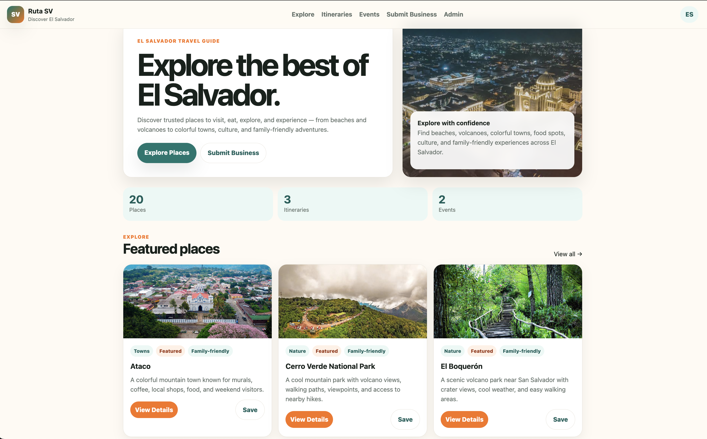
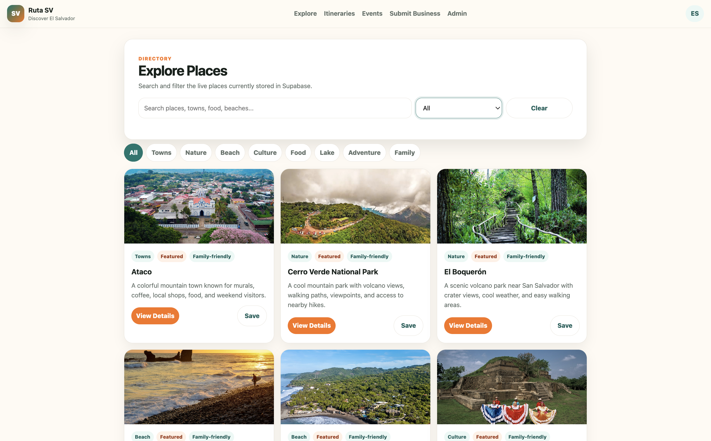
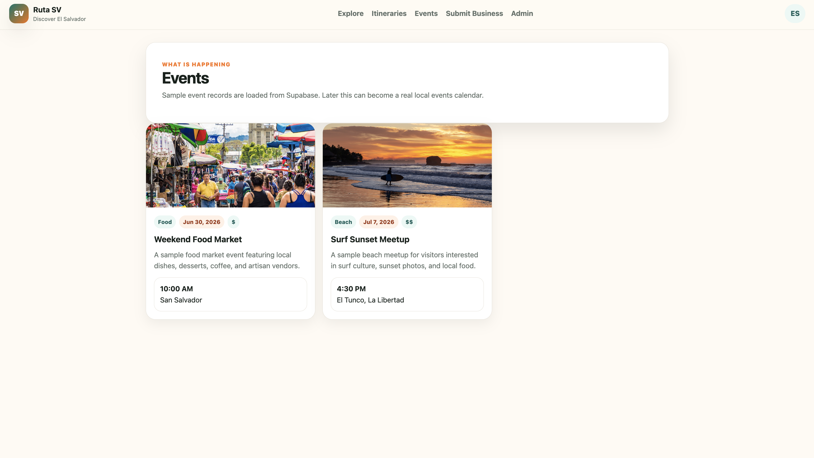

# Ruta SV

Ruta SV is a tourism and destination discovery platform focused on showcasing locations, experiences, and attractions across El Salvador.

This project was built as part of my growing interest in SaaS platforms, AI-assisted development, and digital solutions for tourism and small businesses.

## Features
- Responsive modern website
- Tourism destination listings
- Google Maps integration
- Mobile-friendly layout
- Interactive UI sections
- AI-assisted development workflow

## Technologies Used
- HTML
- CSS
- JavaScript
- Netlify
- GitHub

## Live Demo
[https://rutasv.netlify.app/]

## Purpose
The goal of this project was to explore how AI tools and modern web technologies can accelerate development and create practical business solutions.
## Screenshots

### Homepage

### Mobile View

### Maps Section

